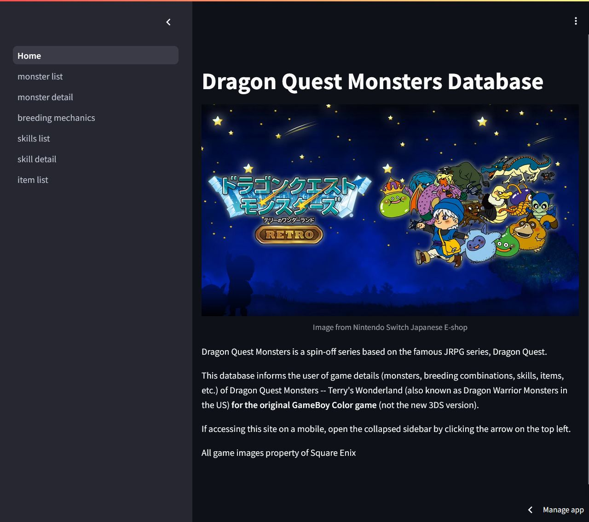
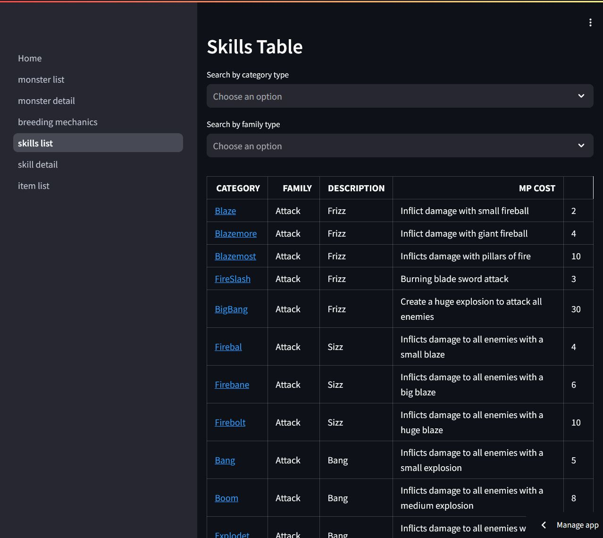

# Streamlit frontend for DQMonstersDB-FastAPI

## Intro - What is Dragon Quest Monsters?
Dragon Quest Monsters is a spin-off series based on the famous JRPG series,
Dragon Quest. This database informs the user of game details (monsters, skills,
items, etc.) of [Dragon Quest Monsters -- Terry's Wonderland](https://en.wikipedia.org/wiki/Dragon_Warrior_Monsters)
(also known as Dragon Warrior Monsters in the US).

Released in Japan in 1998 for the Gameboy Color by Enix, it was compared to the
Pokemon series due to their similar gameplay of taming and training monsters
to battle other monsters via random encounters. However, gameplay differs with
its roguelike dungeon levels, the battle play, and the breeding system.

The game is quite old and not many copies are in circulation. The current way
to play the game is to buy "Dragon Quest Monsters -- Terry's Wonderland RETRO"
for the Nintendo Switch on the Japanese Nintendo eShop or on Google Play and
Apple Store by setting your region to Japan (the game will be in Japanese).
Otherwise, use an emulator and download the English version or buy a physical
cartridge.

## Project Description

This repository is the frontend for the DQMonstersDB FastAPI project
<https://github.com/cmsato09/DQMonstersDB-API> using
[Streamlit](https://streamlit.io/), a minimal open-source python framework
primarily used to build and share data apps quickly. However, it can be used to
create a quick frontend for anything in python.

This framework was recommended to me to get a mvp out as soon as possible,
rather than learning Javascript and React from the beginning and get immediate
feedback about the data being displayed.

I am planning on learning more about frontend using React and
remaking the frontend.

## How to Run
This repo is deployed on [Streamlit Cloud](https://docs.streamlit.io/streamlit-cloud).

Go to https://dqmonstersdb.streamlit.app to access the app online.

## How to Run Locally
### Run Streamlit repo locally using hosted FastAPI
1. Clone this repo
2. Add dependencies to virtual environment
3. In the `helper_functions.py` file, make sure the line
`API_BASE = "https://dqmonstersdb-api-743047725852.us-central1.run.app"` is uncommented.
4. Run `streamlit run Home.py` in the terminal
5. The Streamlit app should automatically open http://localhost:8501 on your
local browser. If not, type or copy/paste the address into your browser
of choice.

### Run both FastAPI and Streamlit locally
1. Clone [FastAPI repo](https://github.com/cmsato09/DQMonstersDB-API)
2. Follow [How to Run Locally](https://github.com/cmsato09/DQMonstersDB-API?tab=readme-ov-file#how-to-run-locally)
section. Have the FastAPI run before you try to run the streamlit app.
3. Locally run Streamlit app
   1. Open new terminal for streamlit folder
   2. In the `helper_functions.py` file, make sure the line pointing to the deployed API,
   `API_BASE = "https://dqmonstersdb-api-743047725852.us-central1.run.app"` is ***commented***, and
   `API_BASE = "http://localhost:8000"` is **uncommented**.
   3. Run `streamlit run Home.py` in the terminal
   4. The Streamlit app should automatically open http://localhost:8501 on your
   local browser. If not, type or copy/paste the address into your
   browser of choice.
   5. FastAPI must simultaneously run with the Streamlit app

## Resources used to make project
- Streamlit documentation <https://docs.streamlit.io/>
- community forum <https://discuss.streamlit.io/>
- issues tab on the streamlit github repo
- python [pandas](https://pandas.pydata.org/pandas-docs/stable/user_guide/index.html#user-guide)

## Credits
This project was done with help and mentoring by [Bob Belderbos](https://github.com/bbelderbos)
through the [Pybites Developer Mindset Program](https://pybit.es/catalogue/the-pdm-program/)

Thank you Bob for the support and help for making it fun to learn, struggle
through, and just figuring it out.
